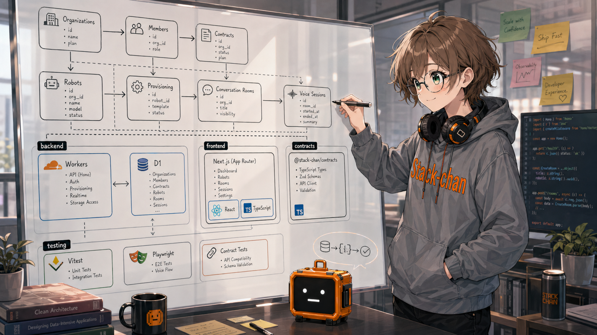
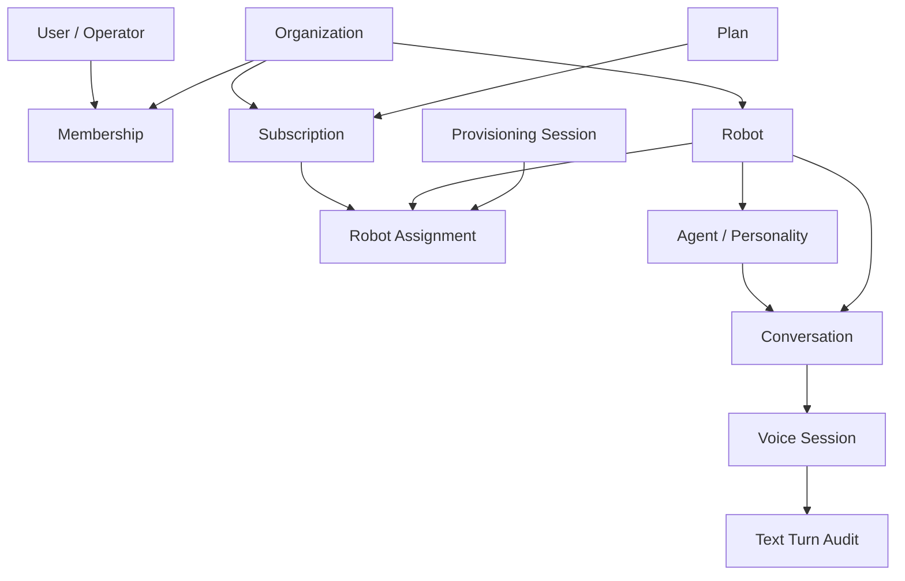
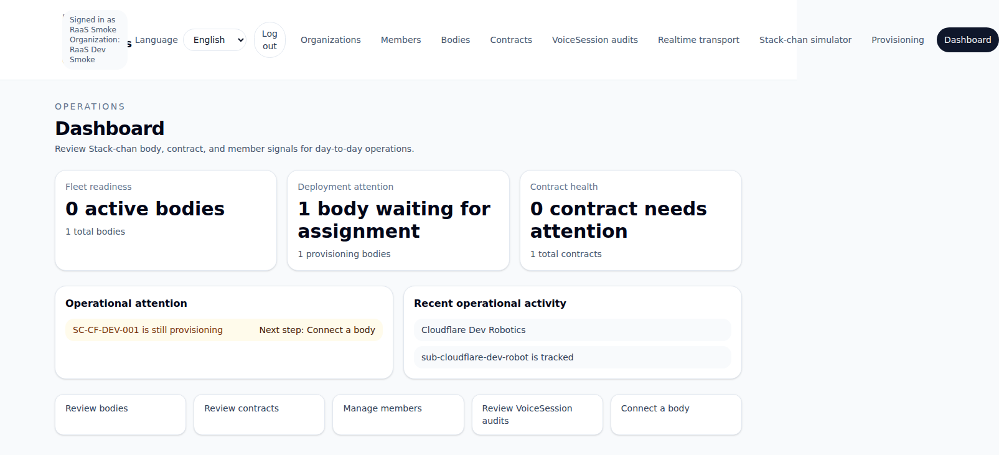

Stack-chan の管理用 Web サービスを作っています。

ここでいう管理用 Web サービスは、Stack-chan を持つユーザーや運用者が、アカウントを作り、組織を作り、端末を登録し、最初の会話まで進めるための基盤です。まだ公開 URL は出していませんが、認証、管理画面、プロビジョニング、音声セッション、Cloudflare 上の実行基盤まで、ひとつずつ形にしています。

この開発では、Hermes と Codex をかなり深く使っています。Slack で指示し、cron で自走させ、必要なところだけ人間が判断する。人間がずっと横に張りつくのではなく、複数の開発レーンが少しずつ前へ進む形を試しています。

## 何を作っているか

大きく見ると、Stack-chan 向けの RaaS、Robot as a Service の管理基盤です。

最初の対象は、ユーザー100名未満くらいの小さな規模です。無料枠から、月1000円以内くらいで運用できることを意識しています。一方で、作りは雑にしない方針にしました。小さいサービスだからこそ、後から破綻しづらい土台にしておきたいからです。

クラウド基盤には Cloudflare を選びました。これまで私があまり使ってこなかった基盤を選び、Workers、D1、周辺のデプロイ構成を実際に触りながら理解する目的もあります。

現時点で含んでいる主な領域は次のとおりです。

- Clerk を使った認証と、DB 側の membership 管理
- 組織、メンバー、契約、ロボット、割り当ての管理 UI
- Stack-chan のプロビジョニング導線
- 会話ルームと音声セッションのモデル
- STT / LLM / TTS パイプラインの Cloudflare スタック上での実装
- Prisma + PostgreSQL と D1 / Worker の並行インフラ
- Terraform、CI、テスト、設計ドキュメント

「とりあえず動く画面」よりも、「小さくても商用に近い作り」を優先しています。

## 進め方: Slack から複数レーンを動かす

開発の中心は Hermes と Codex です。私は Slack で大きめの目標を渡し、Hermes が GitHub Issue を起票し、Codex や cron の実行単位へ分け、実装、レビュー、修正まで進めます。

よく渡している指示は、かなり抽象度が高いです。

- 「管理者向け UI を整えて」
- 「ユーザーがアカウント作成から最初の Stack-chan をデプロイして会話するまでのジャーニーを実装して」
- 「STT / LLM / TTS パイプラインを、Cloudflare スタックで完結させて実装して」

この粒度の指示を、そのまま一回の作業で終えるのは無理があります。そこで、Issue に分け、設計メモを書き、テストを先に置き、実装して、レビューゲートを通す流れにしています。

運用としては、cron で自走する開発を3並列で回しつつ、スポットで Slack から追加指示を出しています。環境変数や API キーのように人間の判断や手元作業が必要なところは、Slack で伴走しながら進める方が速いです。

## 最初は厚めに見る

この手の開発は、最初の足場を薄くしすぎると後でつらくなります。今回は、最初から少し厚めに見ました。

TypeScript の monorepo にし、backend、frontend、contracts を分けました。backend では関数型DDD寄りにし、ユースケース、ドメイン、リポジトリ、HTTP 境界を分けています。エラー処理も、例外を投げ散らかすより Result スタイルで境界を明確にする方向です。

構成はだいたい次のようにしています。途中の階層までに絞ると、責務の分け方が見えやすくなります。

```txt
raas/
├── apps/
│   ├── backend/                 # API / Worker / domain / use case
│   │   ├── prisma/              # PostgreSQL と D1 の schema / migrations
│   │   └── src/
│   │       ├── app/             # app configuration / composition root
│   │       ├── application/     # use cases / ports / ids
│   │       ├── domain/          # pure domain model and policies
│   │       ├── infrastructure/  # Prisma, D1, LLM adapters
│   │       ├── interfaces/      # HTTP routes and request boundaries
│   │       └── shared/          # Result, validation helpers
│   └── frontend/                # Vite + React admin UI
│       └── src/
│           ├── app/             # layout / router
│           ├── entities/        # API clients and entity-facing code
│           ├── pages/           # screen-level components
│           └── shared/          # UI primitives, i18n, API helpers
├── packages/
│   └── contracts/               # frontend/backend shared contracts
├── infra/
│   └── terraform/               # Cloudflare IaC
└── docs/
    ├── adr/                     # architecture decisions
    ├── design/                  # design notes
    └── runbooks/                # operation notes
```

テストは、原則として対象の `.ts` と同じ階層に `.spec.ts` を置いています。仕様を近くに置くと、実装を読んだときに「何を守りたいコードなのか」まで同時に見られます。

```txt
apps/backend/src/domain/robots/
├── robot.ts
└── robot.spec.ts
```

たとえば `Robot` は、空の ID や serial number を例外で落とすのではなく、Result のエラーとして返します。

```ts
export type Robot = Readonly<{
  id: RobotId;
  organizationId: OrganizationId;
  serialNumber: string;
  status: "provisioning" | "active" | "retired";
}>;

export const createRobot = (input: {
  id: RobotId;
  organizationId: OrganizationId;
  serialNumber: string;
  status?: Robot["status"];
}): Result<Robot, RobotValidationError> => {
  const id = input.id.trim();
  const organizationId = input.organizationId.trim();
  const serialNumber = input.serialNumber.trim();

  if (serialNumber.length === 0) {
    return err({ type: "robot_serial_number_required" });
  }

  return ok({
    id,
    organizationId,
    serialNumber,
    status: input.status ?? "active",
  });
};
```

同じディレクトリの spec には、守りたい振る舞いを書きます。

```ts
it("creates an active robot by default", () => {
  const result = createRobot({
    id: "robot-1",
    organizationId: "org-1",
    serialNumber: "SC-001",
  });

  expect(result.isOk()).toBe(true);
  expect(match(result, { ok: (robot) => robot.status, err: () => "retired" })).toBe("active");
});
```

フロントエンドも、ページをただ並べるのではなく、管理画面としての情報設計を意識しています。組織、メンバー、契約、ロボット、プロビジョニング、音声セッションといった対象が増えるので、最初からコンポーネント設計と画面構成を崩しすぎないようにしました。

ADR と design ドキュメントも置いています。ただし、ドキュメントが実装から離れるとすぐに負債になります。設計で決めたことは、できるだけテストに落とす。設計仕様を Markdown だけに閉じ込めず、spec として残すことを意識しています。

## ドメイン設計からコードへ落とす

最初にやったのは、画面ではなくドメインの壁打ちでした。



Stack-chan を企業や店舗で使うとき、何を管理したいのか。端末そのもの、端末の人格、契約、割り当て、会話ログ、音声セッション、運用者の権限。これらを先に言葉にしてから、コード上の概念へ落としました。

この順番にしたことで、後から UI を作るときにも、画面が単なる CRUD の寄せ集めになりにくくなりました。たとえば「ロボットを作る」だけではなく、「どの組織の、どの契約に、どの端末を割り当てるのか」という問いが自然に出てきます。

簡略化すると、今のドメインモデルは次のような関係として見ています。



図にすると、`Robot` 単体ではなく、`Organization`、`Subscription`、`ProvisioningSession`、`RobotAssignment` が一緒に出てきます。管理画面もこの関係を隠しすぎないようにしつつ、初回導線では順番に進められる形へ寄せています。

## 現時点の規模

2026年5月1日時点のローカルリポジトリで確認した数字です。

- 対象リポジトリ: `meganetaaan/raas`
- tracked な対象ファイル: 436 files
- tracked なコード寄りファイル: 377 files
- コード寄りの raw line count: 51,182 lines
- spec ファイル: 161 files
- 通常テスト: 156 files / 1,079 tests passed
  - frontend: 28 files / 149 tests
  - backend: 128 files / 930 tests

行数は `git ls-files` を元に、TypeScript、TSX、CSS、SQL、Prisma、Terraform などを含めて数えた raw count です。生成物や `node_modules` は除外しています。厳密な SLOC ではありませんが、今の規模感を見るには十分です。

テストは `pnpm test` で確認しました。最初に `pnpm test -- --runInBand` を試したところ、contracts の `tsc` に余分な引数が渡って失敗しました。引数なしの `pnpm test` では、contracts の typecheck、frontend、backend のテストが通っています。

## 画面は後から整えたくなる

自走開発でよく起きるのが、画面の散らかりです。

最初は、実装した順にボタンやリストが増えます。名前も無機質になりがちです。機能は増えているのに、初めて触る人には何をすればよいか分からない画面になります。



この画面も、その時点では必要な情報を集めています。Fleet readiness、契約、メンバー、VoiceSession audit、プロビジョニングへの導線はあります。ただ、画面上の密度が高く、初めて見る運用者に「まず何を見るか」を渡しきれていませんでした。

そこで、UI レビュー用のスキルを入れました。情報設計、アクセシビリティ、初回導線、空状態、モバイル幅、管理者が迷わない文言などを、レビューゲートとして見るようにしています。

この効果は大きかったです。単に見た目を整えるだけでなく、「この画面でユーザーは何を判断するのか」「次の行動は見えているか」「空のときに何が起きているか」を確認するようになりました。

スクリーンショットは公開前なので、この記事にはまだ載せていません。公開できる状態になったら、管理画面、プロビジョニング、音声セッションの3枚くらいを追加したいです。

## 環境が足りないところは人間が伴走する

もうひとつ分かったのは、API キーやクラウド環境が足りないまま、エージェントが足踏みする場面です。

コードだけで完結する作業なら、cron でかなり進みます。テストを足す、型を直す、設計メモを書く、Issue を分ける、UI を改善する。こういう作業は自走と相性がよいです。

一方で、Clerk、Cloudflare、SOPS、環境変数、デプロイ先の権限のようなものは、人間の手元作業が混ざります。ここは Slack で一緒に進める方がよいです。「ここでこの値が必要」「この権限が足りない」「この秘密情報はログに出さない」と確認しながら、短いサイクルで詰まりをほどく方が早く終わります。

## 今のところの感触

Hermes と Codex を使った開発は、かなり実務的に使えています。

任せきりにするというより、任せる粒度を見つけていく感覚です。大目標を渡し、Issue に分け、テストで仕様を固定し、レビューゲートで品質を保つ。人間は、方向づけ、秘密情報、プロダクト判断、最後の違和感を見る。

Stack-chan の管理用 Web サービスは、まだ完成品ではありません。ただ、Cloudflare 上で動かす小さな商用サービスとして、必要な部品はそろい始めています。

次は、公開できるスクリーンショットを撮り、実際のデプロイ URL を安全に案内できる状態にしたいです。そこまで進んだら、この記事ももう一段だけ具体的に更新します。
